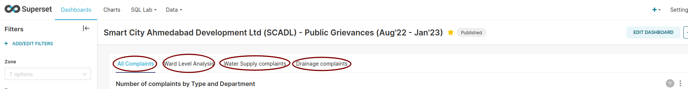

Best practices for a CDL dashboard
===================================

1. Don't overpopulate the dashboard. Use the "TABS" feature to divide a dashboard into multiple pages. Each Tab/Page can present data at one hierarchical level. For example, One tab for all of India, one tab for the state, and one tab for district-level analysis.

2. Use the first tab of the dashboard to provide context about the dataset, especially if the dashboard is used by external partners. Use the text box features to write text.
3. Rename Metric Names as and when necessary to make them self-explanatory. 

4. To present any Hierarchical information - a partition diagram is the best practice at CDL.

5. Use self-explanaotry chart names.
6. Bar chart hygiene checks:
- Consider using top/bottom or thresholds to limit the number of entries. 
- Axis names should always be indicated.
- Rotate the X-axis labels if there are more bars to avoid clutter.

7. Every CDL dashboard contains a Table at the end. Use the Pagination and Search feature if there are many records in the table.
8. When the dashboard is ready to be shared, write a **readable URL slug** for the dashboard. It is available in the Edit Properties section of the dashboard. Also, choose a suitable colour scheme for the entire dashboard

**Dashboards to refer**
1. `SCADL Dashboard (v2) <https://supersetv2.civicdatalab.in/superset/dashboard/p/Z7VEka2NRKQ/>`_
2. `Assam public procurement analysis (v1) <https://superset.civicdatalab.in/superset/dashboard/assam-procure-analysis/>`_ 
3. `POCSO Case law tracker (v1) <https://superset.civicdatalab.in/superset/dashboard/52/>`_ 
4. `Assam flood tenders dashboard(v1) <https://superset.civicdatalab.in/superset/dashboard/flood-tenders-assam/>`_ 
5. `OJDP Pune dashbaord (v1) <https://superset.civicdatalab.in/superset/dashboard/ojdp-pune/>`_ 

**External guidebooks to refer**
1. `Best Practices for Data Visualisation - Royal Statistical Society <https://royal-statistical-society.github.io/datavisguide/rss_conference.html>`_
