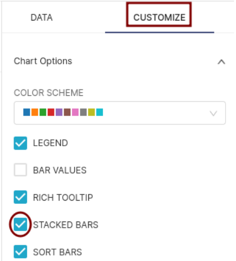
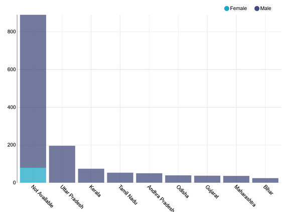

Customise your chart
===================================

1. We can further customize the chart to make it more meaningful and aesthetic. Taking further the bar chart we created in the previous step, we now want a stacked bar chart. To customise a chart, click on the CUSTOMIZE tab.

2. The resultant stacked bar chart looks like this. Similarly, each type of visualisation will have different customisation options. Explore them.

Other customisation options that we generally use are:
1. **COLOR SCHEME:** To select color palette for the legend
2. **X BOUNDS and Y BOUNDS:** To put boundaries on X-axis and Y-axis
3. **X AXIS and Y AXIS LABELS:** Write self-explanatory label names for X-Axis and Y-Axis
4. **FORMAT**: To change the format in which the numbers should be represented on the chart. Eg: You can decide to show only 2 decimal points.

These options also vary from one visualisation type to another. Explore them for each visualisation to build the best possible chart.
