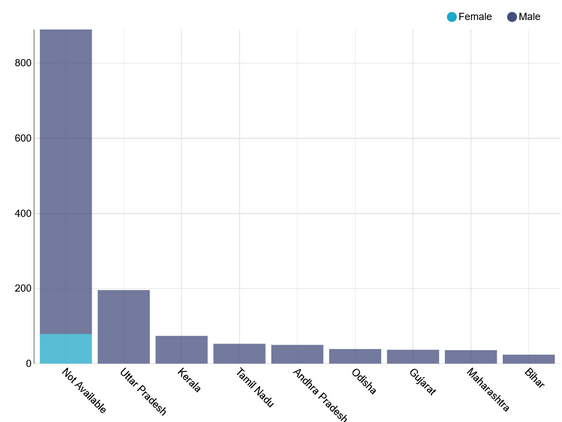

Example charts
===================================

Important visualization types that are generally added to our dashboards, with a few examples:

1. **Tree maps:** For Treemaps, we just select one DIMENSION and a METRIC (COUNT) to apply on it. Here, we count the number of judges from each “Parent High Court”

2. **Sankey Diagram:** They are helpful in understanding the flow of metrics from one set of variables to another. For instance, we want to see how many judges belonging to a particular state end up working in the High Court of the same state. We choose Sankey Diagram as visualisation; SOURCE and TARGET variables as “State of Birth” and “Parent High Court” and METRIC as COUNT. We thus get the following diagram.

3. **Big Number:** The query for Big Number visualization is simple. You just have to select the Metric that you want to show in Big Numbers. Here, we show the COUNT of the Total number of Judges.

Here are a few examples of other charts:
1. `Histograms <https://www.youtube.com/watch?v=MTK4TdgICB0&list=PLzRV_ObjEwmNhRjhMNcvcDP7ZDjOXtodd&index=17>`_
2. `Dual axis line charts <https://www.youtube.com/watch?v=NWgHOt-_-sc&list=PLzRV_ObjEwmNhRjhMNcvcDP7ZDjOXtodd&index=22>`_
3. `Bullet charts <https://www.youtube.com/watch?v=3lQ9414FCgA&list=PLzRV_ObjEwmNhRjhMNcvcDP7ZDjOXtodd&index=21>`_ 
4. `Sunburst chart <https://www.youtube.com/watch?v=MriBCYvbN6Q&list=PLzRV_ObjEwmNhRjhMNcvcDP7ZDjOXtodd&index=20>`_ 
5. `Chord diagram <https://www.youtube.com/watch?v=UdKoggg7E3g&list=PLzRV_ObjEwmNhRjhMNcvcDP7ZDjOXtodd&index=19>`_ 
6. `Graph charts <https://www.youtube.com/watch?v=IuEXk-LDM2s>`_ 
7. `Bubble charts <https://www.youtube.com/watch?v=KNhI6FtEtsc>`_ 
8. `Nightingale rose charts <https://www.youtube.com/watch?v=sOqYi1wS9Vc>`_ 
9. `Word clouds <https://www.youtube.com/watch?v=Tw3XZAKB0tg>`_ 
