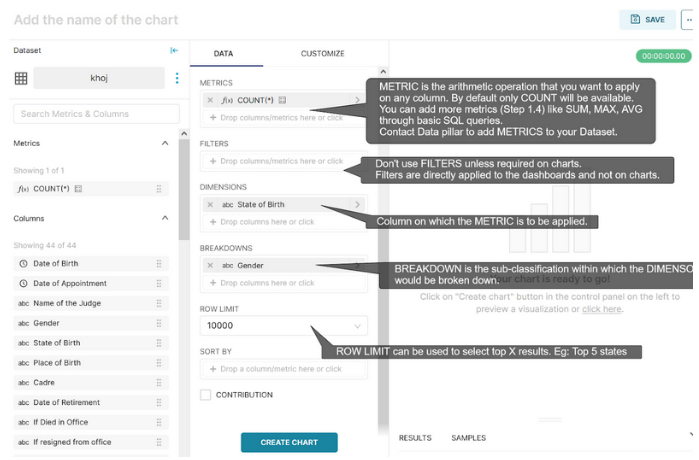

Making your first chart
===================================

1. Create a new chart from the Charts window.

2. Select the Dataset you uploaded and also the type of chart (visualization). We commonly use bar charts, Sankey diagrams, line charts, partition charts, area charts and simple table/pivot table charts.

Alternatively, you can directly click on the table name to open the chart window. The chart window looks like this:

3. You can add more “SIMPLE” METRICS like SUM, AVG, MAX etc., by clicking on it. You can also write CUSTOM SQL for advanced Metrics.

4. And the first chart is created.  We visualized the number of judges in each state based on their state of origin. We also want to see a gender split in each state. So we choose "Gender" as a "DIMENSION". A bar chart is an appropriate visualization for this. Save the chart.

Now that we created a new chart, we can further customise it.
