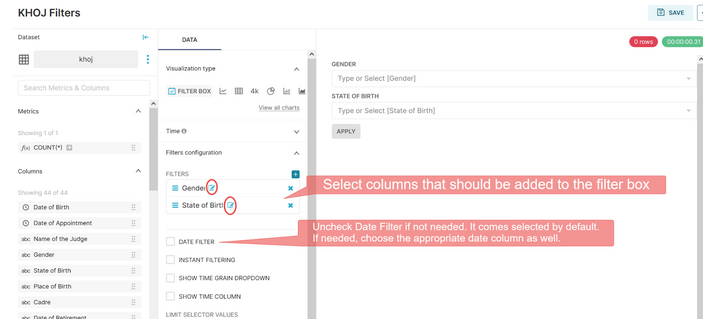
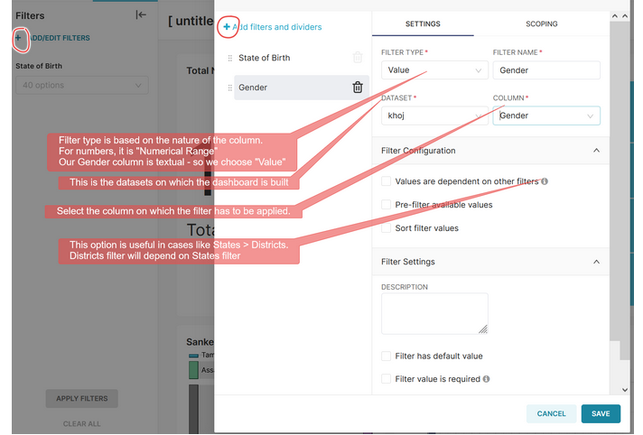
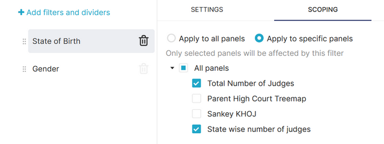
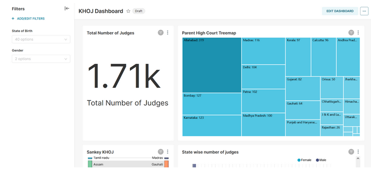

Use of filters
===================================

There are two ways in which you can add filters to the dashboard.

**FILTER BOX –** If you want to make filters visible on the dashboard, filter boxes can be used. It consists of columns on which filters will be applied. This FILTER BOX is also a “Chart”.

**You can also add filters directly on the dashboard**

**SCOPING** is useful to select the charts on which the filter is applicable. By default, the filter will be applicable to all charts on the dashboard. For instance, we made the “State of Birth” filter inapplicable to the Sankey and Treemap charts that we created.

Use Filter Boxes only when it is necessary to see filters on the dashboard.
Otherwise, adding filters directly on the dashboard is easier and more versatile due to the SCOPING functionality. 

We have created our first dashboard with filters!

