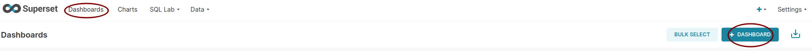
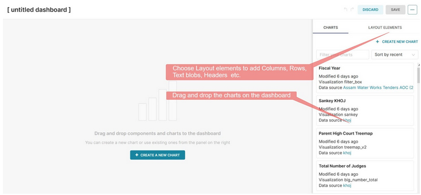

Making your first dashboard
===================================

1. Create a new dashboard from the dashboards window.

2. The newly created empty dashboard looks like this. 

Click on the “Edit Dashboard” button to insert charts, text blobs etc. They can be just dragged and dropped into the dashboard. Use columns and rows (LAYOUT ELEMENTS) to organize the dashboard well.

