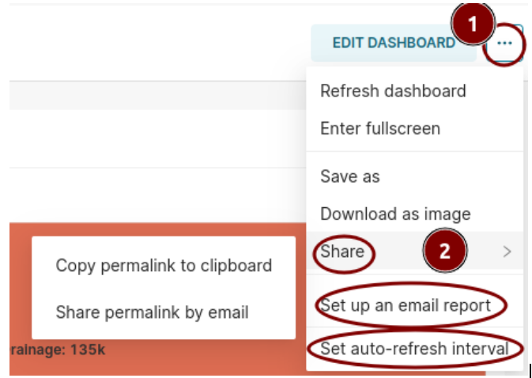
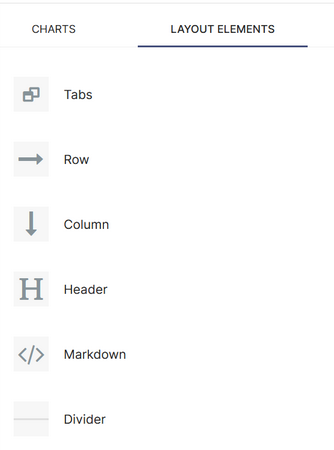

Publishing and documentation of dashboards
===================================

Once ready, the dashboard can be shared as a link or an email report.

Also, if the dataset is a database which gets updated frequently, you can choose an auto-refresh interval for the dashboard.
Before sharing the dashboard, ensure that branding, logos and other elements of the design language of CDL are taken care of.

**DOCUMENTATION OF DASHBOARD**
Documentation of dashboards is making the charts more comprehensible for the layperson. You can make use of LAYOUT ELEMENTS” for documentation. 

Markdowns and Headers are used for writing text blobs explaining charts and citing data sources.

This is a good source to know how to write text using Markdown –

`Link <https://docs.github.com/en/get-started/writing-on-github/getting-started-with-writing-and-formatting-on-github/basic-writing-and-formatting-syntax>`_