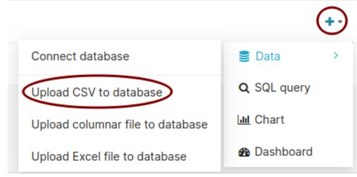
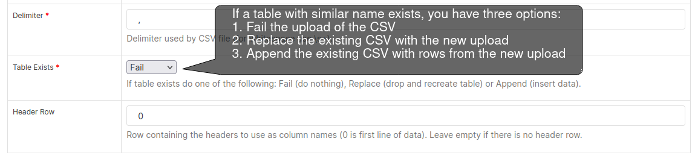
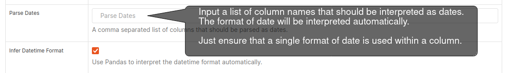
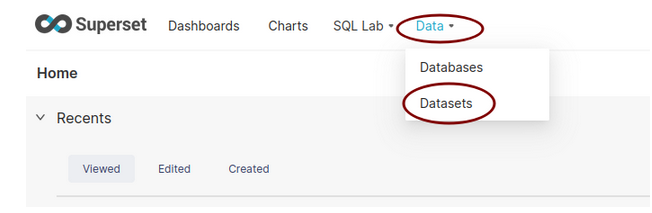
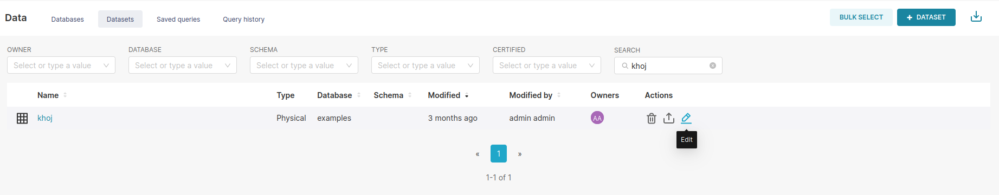

Upload a CSV
===================================

You can upload a dataset either by connecting to a database or by uploading a CSV.
Ensure that a final version of the dataset is uploaded.
**The data pillar will have taken care of uploading important datasets onto Superset.**
If you have a CSV that you want to explore, upload a CSV. 

As an example, `KHOJ dataset <https://justicehub.in/dataset/khoj-india/resource/fa59eb2e-04a5-461f-94e3-1367f67c3a8c>`_ will be used in this handbook.
Upon clicking `upload CSV to database` a settings window will open. You can leave most of the settings default. But make note of the following settings:

1. Table Exists:

2. Parse dates:

Once uploaded, a Dataset gets created in the Superset. You can check all the uploaded CSVs here:

By default every column in the Dataset will be `GROUPABLE` and `FILTERABLE`.
However, if there are dates/times in any of the columns, those columns should be identified as `TEMPORAL`. It will help in building time series charts.

To enable such operations on each of the columns, edit the table that you uploaded.
You can do that by clicking on the pen button at the end of the table row. Hover the cursor under the `Actions` column to find it.

With that you have succesfully uploaded a CSV on to the Superset.
